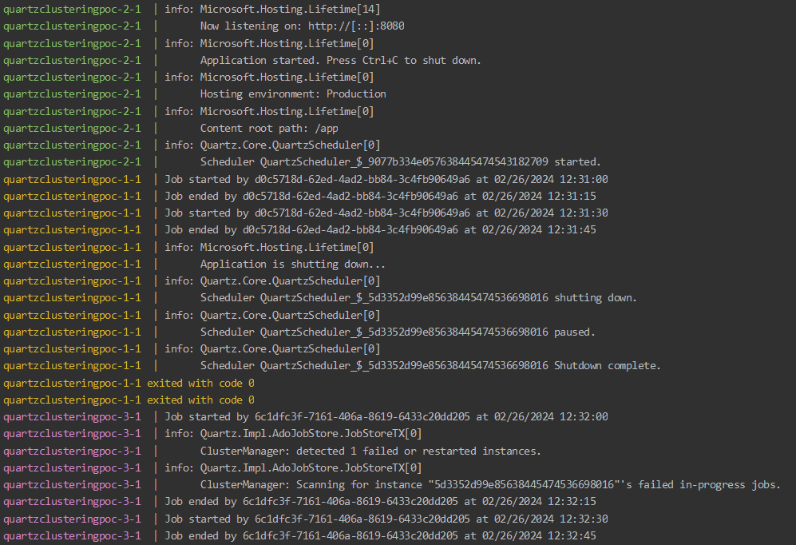
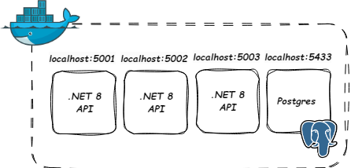

# QuartzClusteringPoC
  

This project implements jobs executions in one replica only in multi-replica application  with utilization of Quart.NET library

## Table of contents
* [General info](#general-info)
* [Technologies](#technologies)
* [Setup](#setup)
* [Status](#status)
* [Inspiration](#inspiration)

## General info

The implementation is really simple as Quartz.NET comes with out-of-the-box clustering mechanism. Database contains a proper schema which provides reliable and only source of truth about executed jobs. Replicas communicate with the database and aware who is executing job, if execution is running now etc. Failovers and retries is also available.

Pic.1 Example of failover mechanism

Overall project consists of four docker containers. Three with .NET API and one with postgres database.

Pic.2 Visualization of docker compose project

## Technologies
* .NET 8
* Postgres
* Docker
* Quartz.NET

## Setup
1. Run docker compose in src folder: `docker-compose up`

## Status
Project is: _finished_

## Inspiration
Shower thoughts